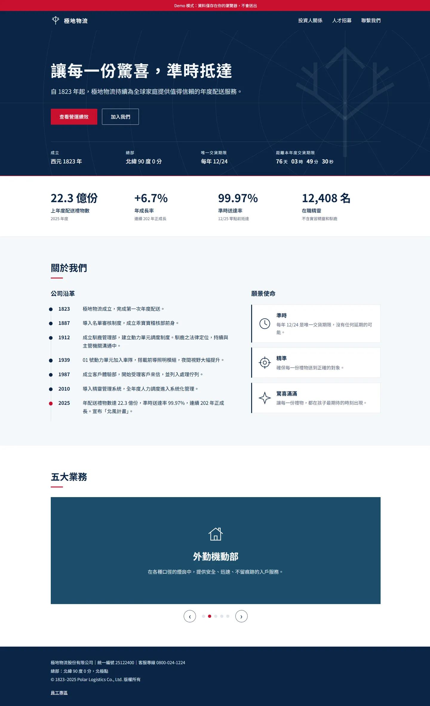
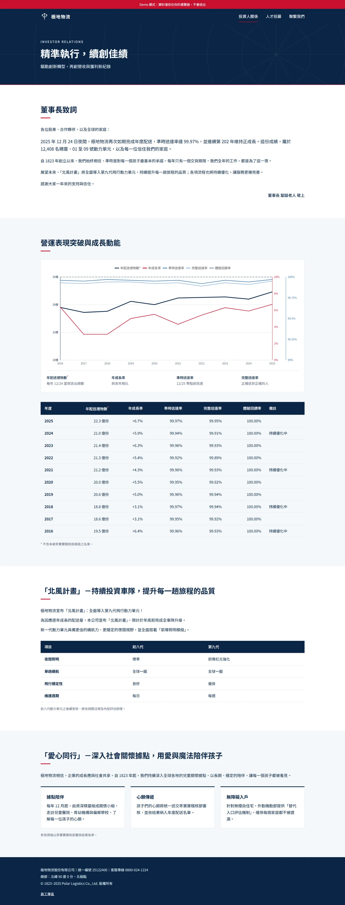
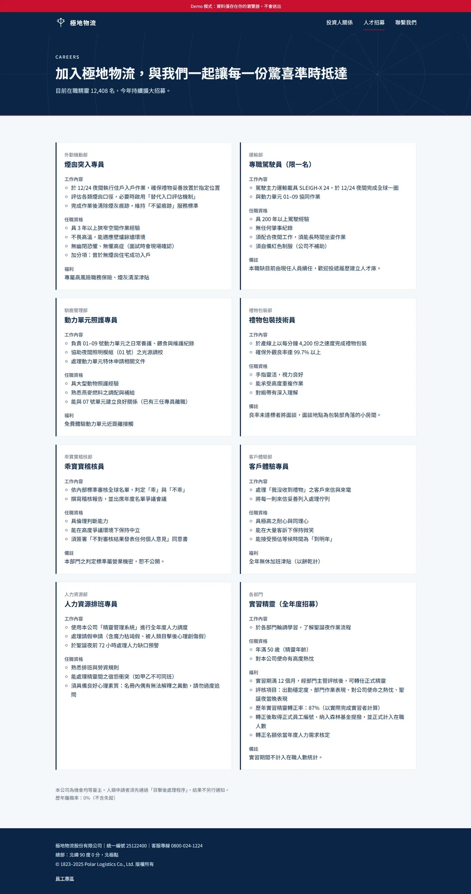
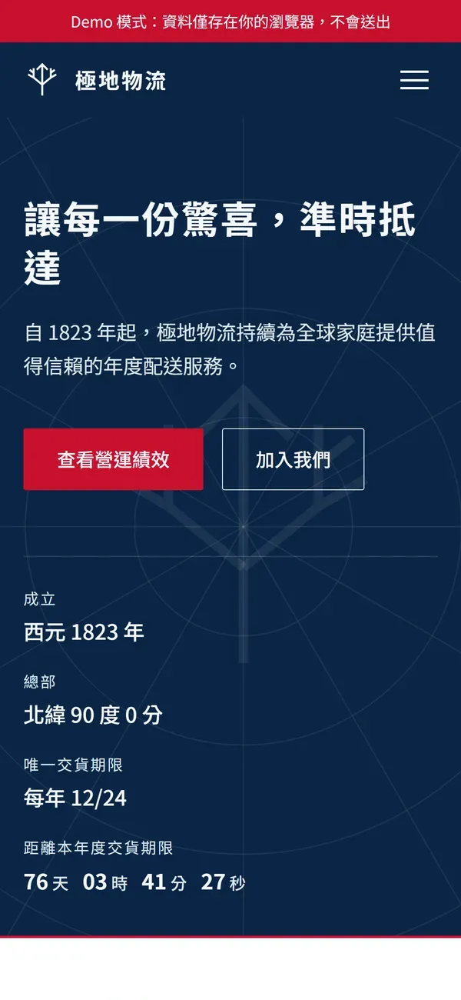
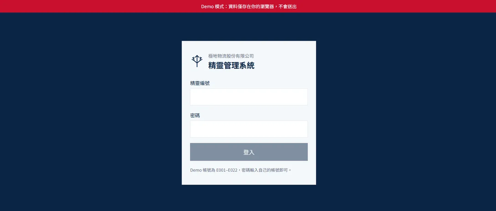
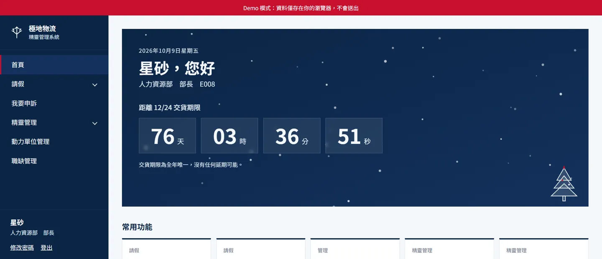
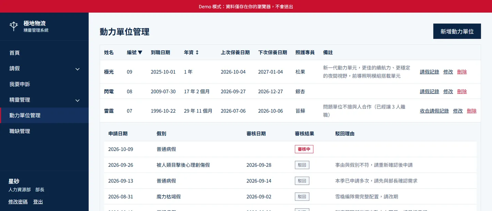

# 極地物流股份有限公司 Polar Logistics Co., Ltd.

虛構的聖誕老人物流公司，官網與精靈管理系統。

## 技術棧
- 後端：Laravel 13（純 API）
- 前端：Vue 3 + Vue Router + Vite + TypeScript
- 伺服器：nginx 1.27
- 資料庫：MySQL 8.4
- 環境：Docker

## 專案結構
```
polar-logistics-co/
├── apps/
│   ├── api/        # Laravel 13 純 API
│   ├── website/    # 官網
│   └── admin/      # 精靈管理系統（內部系統）
├── shared/         # 品牌色／字體、共用元件、api 抽象層
├── docker/         # php、nginx 設定
├── docs/           # 設定與技術文件
├── scripts/        # GitHub Pages 建置腳本
└── docker-compose.yml
```

## 文件
- 設定與文案（唯一來源）：
  - [品牌與視覺規範](docs/brand.md)
  - [官網設定](docs/website.md)
  - [精靈管理系統設定](docs/admin.md)
- 技術細節：
  - [架構](docs/architecture.md)
  - [資料庫](docs/db-scheme.md)
  - [API 清單](docs/api.md)
  - [官網實作](docs/website-implementation.md)
  - [管理系統實作](docs/admin-implementation.md)
- 其他：
  - [Demo 策略](docs/demo-strategy.md)
  - [程式碼風格](docs/coding-style.md)

## Demo
部署到 GitHub Pages 的靜態 Demo，資料僅存在瀏覽器。

- 官網：https://lingpluszero.github.io/polar-logistics-co/
- 精靈管理系統：https://lingpluszero.github.io/polar-logistics-co/admin/（Demo 帳號 E001–E022，密碼輸入自己的帳號；任何操作只存在你的瀏覽器）

首次啟用需到倉庫 Settings → Pages，Source 選「GitHub Actions」；之後 push 到 `main` 會自動部署，細節見 `docs/demo-strategy.md`。

## 截圖
### 官網
<table>
  <tr>
    <th>首頁</th>
    <th>投資人關係</th>
    <th>人才招募</th>
  </tr>
  <tr>
    <td valign="top"></td>
    <td valign="top"></td>
    <td valign="top"></td>
  </tr>
</table>
<table>
  <tr>
    <th>手機版（RWD）</th>
  </tr>
  <tr>
    <td valign="top"></td>
  </tr>
</table>

### 精靈管理系統
| 登入 | 首頁 |
|---|---|
|  |  |

| 管理表格（動力單位管理）|
|---|
|  |

## 如何本機用 Docker 跑完整版
首次啟動前，先設定精靈預設密碼（不進版控）：
```sh
cp apps/api/.env.example apps/api/.env   # 然後在 .env 填入 ELF_DEFAULT_PASSWORD（至少 12 字元）
```

```sh
docker compose up -d          # 啟動全部服務，並自動 migrate
```

| 服務 | 網址 |
|---|---|
| 官網 | http://localhost:5173 |
| 精靈管理系統 | https://localhost:5174（自簽憑證，瀏覽器會警告） |
| API（nginx） | https://localhost:8443/api（自簽憑證，瀏覽器會警告；8080 只轉址到 HTTPS） |
| MySQL | localhost:33060（polar / polar） |

- 前端開發環境的模式由各 app 的 `.env.development` 決定，`VITE_DEMO_MODE` 改 `true`／`false` 即可切換。
- 首次開啟 HTTPS 網址，瀏覽器會警告自簽憑證，選「繼續前往」即可。
- 首次啟動需安裝 composer 與 npm 套件，請稍等。
